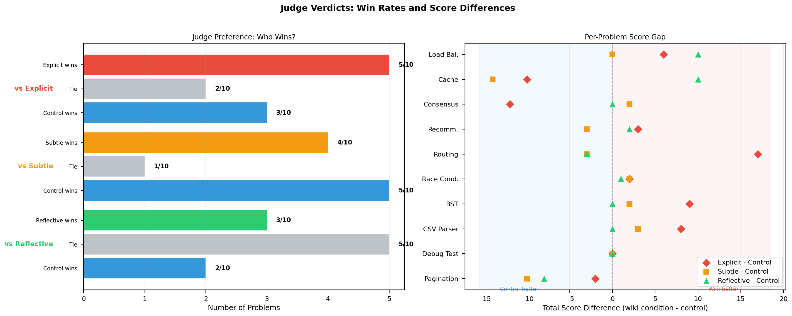
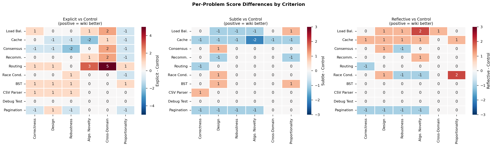
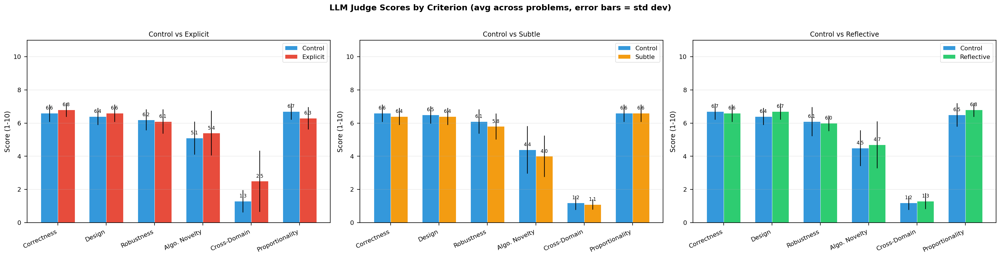
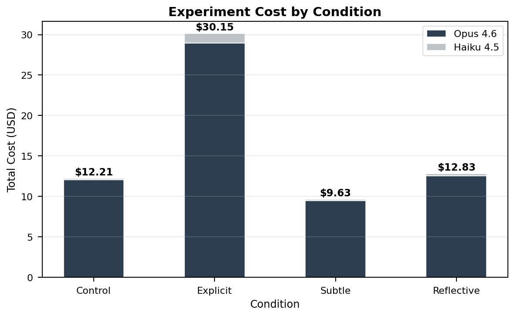

# Wikipedia Knowledge Agent

**Does giving a coding agent access to all of human knowledge change how it solves problems?**

An experiment in lateral knowledge transfer. We give [Claude Code](https://docs.anthropic.com/en/docs/claude-code) access to the entirety of Wikipedia (~6.8M articles) via ripgrep, then test whether cross-domain knowledge — biology, history, philosophy, materials science — changes how it approaches coding problems.

The hypothesis: humans don't solve problems using only domain knowledge. A biologist who codes brings different intuitions than a pure CS grad. What if an agent armed with all of human knowledge finds analogies and makes lateral connections a pure-coding agent wouldn't?

## The Experiment

10 coding problems. 8 conditions. 80 runs. Blind evaluation + deterministic benchmarks.

Claude Code runs in non-interactive mode (`-p` flag) against each problem. The only variable is what knowledge tools are available and how they're presented:

#### Wave 1 — Knowledge access strategies

| Condition | Wikipedia | Strategy |
|-----------|:---------:|----------|
| **Control** | -- | Baseline. No Wikipedia, no special framing. |
| **Explicit** | Full | Told to research Wikipedia before coding. Given wiki-explorer agent for cross-domain analogues. |
| **Subtle** | Full | Wikipedia tools available via plugin but never mentioned in the prompt. |
| **Reflective** | Full | Framed as a historically-informed engineer. Given wiki-reflector agent for precedent and proportionality. |

#### Wave 2 — Knowledge framing strategies

| Condition | Wikipedia | Strategy |
|-----------|:---------:|----------|
| **Flaneur** | Full | Random walk through Wikipedia before coding. No directed search — wander, then reflect on what emerged. |
| **Consilience** | Full | Hunt for convergent evidence: the same structural pattern appearing independently in 3+ unrelated domains. |
| **Biomimetic** | Full | Look only at biological/ecological systems for how nature solves the same structural problem. |
| **Contrarian** | Full | Adversarial: actively search for evidence that the obvious approach is wrong, fragile, or historically problematic. |

Each pair (control vs condition) is evaluated by an LLM judge in a blinded A/B comparison with randomized position assignment. Comments are stripped from code before evaluation — the judge scores the *code*, not the narrative.

Design-quality problems (1–5) also get **deterministic benchmarks** — tick-based simulations that score implementations 0–100 on detection speed, priority protection, recovery smoothness, and other behavioral metrics. This eliminates judge subjectivity for the most important axis: does the code actually perform well?

## Results — Wave 1

Total experiment cost: **$64.82** across 40 runs (10 problems x 4 conditions).

### Who wins?



| Condition | W | L | T | Avg Score Delta |
|-----------|:-:|:-:|:-:|:---:|
| **Explicit** | 5 | 3 | 2 | **+2.2** |
| **Reflective** | 3 | 2 | 5 | +0.9 |
| **Subtle** | 4 | 5 | 1 | -2.3 |

**Overall**: 12 wiki wins, 10 control wins, 8 ties across 30 comparisons. Average delta: +0.3.

Wikipedia access does not produce a reliable, consistent improvement. The effect is highly problem-dependent.

### Where Wikipedia helps (and where it doesn't)



The clearest signal: **Wikipedia helps on problems where algorithm selection matters, and does nothing on mechanical tasks.**

**Biggest wiki win**: Routing (+17 for explicit). The explicit agent used an ALNS metaheuristic — a genuinely state-of-the-art vehicle routing approach — while the control used Clarke-Wright (1964). This is the experiment's strongest evidence that Wikipedia access can produce a categorical jump in algorithm selection.

**Biggest wiki loss**: Cache eviction (-13 for subtle). The control independently produced a more sophisticated architecture (segmented LRU with ARC-style ghost lists) while the subtle condition didn't discover its Wikipedia tools.

**Total wash**: Debug test. All three wiki conditions produced character-for-character identical fixes to the control. Wikipedia is irrelevant for mechanical bug fixes.

### Judge scores by criterion



Scores are averaged across all 10 problems per condition. Explicit shows the most differentiation from control — slightly higher on algorithmic novelty and cross-domain insight, slightly lower on proportionality (tendency to over-engineer when told to research).

### Time and code volume


Explicit runs take ~2x longer on average (534s vs 288s for control) and produce more code. The research phase adds time. Whether this time investment pays off depends on the problem — for routing it was transformative, for debug-test it was pure overhead.

### Cost



Explicit costs 2.5x more than control ($30.15 vs $12.21), driven by wiki-explorer subagent runs on Haiku. The starkest example: race-condition cost $2.50 explicit vs $0.44 control for a tie result. Reflective ($12.83) and subtle ($9.63) are comparable to control — subtle actually costs *less* because it rarely discovered or used the Wikipedia tools.

## Results — Wave 2

*In progress.* Wave 2 adds 4 new conditions (flaneur, consilience, biomimetic, contrarian) and deterministic benchmarks. Results will be published here once all 8 conditions complete across all 10 problems.

## Key Findings (Wave 1)

**1. Explicit Wikipedia access is the strongest condition, but not consistently.**
At 5-3-2 (W-L-T), explicit produces the most dramatic wins but also real losses. When it works, it works by surfacing algorithms the agent wouldn't otherwise consider. When it fails, the research phase introduces overhead or the agent over-engineers based on what it read.

**2. The reflective condition avoids losses but rarely wins decisively.**
At 3-2-5, half of reflective's results are ties. Its philosophy — "what has been tried before, and what went wrong?" — acts as a conservative filter. It shines on problems where proportionality matters (load balancer, cache eviction) but adds little on mechanical tasks (it correctly stays silent on BST, CSV, debug).

**3. The subtle condition barely uses Wikipedia.**
Subagent output tokens (a proxy for wiki tool usage) average ~430 for subtle vs ~4300 for explicit, against a ~350 control baseline. The agent almost never discovers the Wikipedia tools on its own. Subtle is effectively a second control with a slightly different runtime environment.

**4. Problem type determines whether Wikipedia helps.**
Cross-domain design problems (routing, cache eviction, load balancer, recommendation) show the widest score spreads. Standard tasks (debug, BST, CSV) show near-zero deltas. This matches the hypothesis: lateral knowledge matters when algorithm selection matters.

**5. The evaluation methodology is fragile.**
N=1 per cell, single LLM judge, nondeterministic sampling. Re-running the judge on the same code with a different random A/B assignment produced different aggregate rankings. Individual comparisons are informative; aggregate W-L-T tallies should be interpreted cautiously.

## Test Suite

### Cross-domain problems (1-5)

Problems where lateral knowledge from biology, economics, physics, or history could inform the solution architecture:

| # | Problem | Description |
|---|---------|-------------|
| 1 | Load Balancer | Graceful degradation under increasing load — shed low-priority traffic, ramp back during recovery |
| 2 | Cache Eviction | Smart eviction for a social media feed considering recency, popularity, and engagement patterns |
| 3 | Consensus | Byzantine fault-tolerant consensus for distributed nodes despite failures and partitions |
| 4 | Recommendation | Recommendation engine that avoids filter bubbles with configurable exploration/exploitation |
| 5 | Routing | Fleet delivery route optimizer (VRP) with capacity constraints and time windows |

### Standard problems (6-10)

Mechanical or well-defined tasks where cross-domain knowledge is unlikely to help:

| # | Problem | Description |
|---|---------|-------------|
| 6 | Race Condition | Fix a race condition in concurrent bank transfers, prove the fix with tests |
| 7 | BST | Binary search tree with insert, delete, search, traversal, and balancing checks |
| 8 | CSV Parser | RFC-compliant CSV parser/writer from scratch with lossless round-tripping |
| 9 | Debug Test | Fix a broken task scheduler (heap ordering bug) without modifying tests |
| 10 | Pagination | Cursor-based REST API pagination stable under insertions/deletions |

## How Wikipedia Access Works

The agent interacts with Wikipedia through a tiered system built as a [Claude Code plugin](https://docs.anthropic.com/en/docs/claude-code/plugins):

| Component | Type | Used By | Role |
|-----------|------|---------|------|
| **wiki-lookup** | Skill | explicit, subtle | Quick single-article fact retrieval |
| **wiki-explorer** | Agent | explicit | Cross-domain lateral analogy discovery |
| **wiki-reflector** | Agent | reflective | Historical judgment — precedent, proportionality, cautionary tales |
| **wiki-flaneur** | Agent | flaneur | Undirected random walk — wanders Wikipedia, then reflects on connections |
| **wiki-consilience** | Agent | consilience | Convergence hunter — same pattern in 3+ independent domains |
| **wiki-biomimetic** | Agent | biomimetic | Biology-only lens — how nature solves the same structural problem |
| **wiki-contrarian** | Agent | contrarian | Adversarial — searches for evidence the obvious approach is wrong |

All share the same underlying data: ~6.8M Wikipedia articles stored as plain text in `data/articles/`, with greppable indexes for titles, categories, and paths under `data/index/`.

Each condition is restricted to its designated agent (Wave 2 conditions explicitly deny access to other wiki agents). Agents run as subagents on Haiku for cost efficiency.

## Evaluation

Three complementary evaluation methods:

### Quantitative metrics (`eval/collect-stats.sh`)

Extracts per-run metrics from Claude Code's output JSON:

- **Duration** — wall-clock seconds
- **Turns** — number of agent turns (note: undercounts for runs that delegate to subagents)
- **Cost** — total USD from `modelUsage` across all models
- **Subagent output tokens** — Haiku output as proxy for wiki agent activity
- **Lines of code** — Python LOC in workspace (excluding `.venv`, `data/`, `.claude/`, contract `types.py`)
- **Input/output tokens** — summed across all models including subagent work

### LLM-as-Judge (`eval/llm-judge.sh`)

For each problem, pairs control vs each wiki condition in a blinded A/B comparison:

1. Code extracted from both workspaces, comments stripped via Python tokenizer
2. A/B position randomized (coin flip) to avoid position bias
3. Judge scores each solution 1-10 on 6 weighted criteria:
   - **Correctness** (3x) — correct results, edge cases, boundary conditions
   - **Design** (2x) — clean architecture, appropriate abstractions
   - **Robustness** (2x) — failure handling, input validation, graceful degradation
   - **Algorithmic novelty** (2x) — genuinely different/superior algorithm vs textbook approach
   - **Cross-domain insight** (1x) — structural patterns from outside software engineering (must be behavioral, not decorative)
   - **Proportionality** (1x) — complexity proportionate to the problem

Weighted total out of 110. Judge declares a winner or tie.

### Deterministic benchmarks (`tests/benchmarks/`)

For design-quality problems, each implementation is imported and run against deterministic tick-based scenarios with fault injection. This removes judge subjectivity for behavioral quality.

Each problem has a **contract** (`tests/contracts/{problem}/types.py`) defining the interface all implementations must conform to, and a **benchmark** (`tests/benchmarks/{problem}.py`) with weighted scenarios.

Example — Load Balancer benchmark (7 scenarios, 0–100 score):

| Scenario | Weight | What It Tests |
|----------|:------:|---------------|
| Steady State | 1x | Baseline routing evenness |
| Degradation Detection | 2x | Speed of detecting a slow backend |
| Priority Protection | 3x | Critical traffic survives under stress |
| Recovery Smoothness | 2x | Gradual ramp-up without thundering herd |
| Cascading Failure | 2x | Prevents overloading healthy survivors |
| Intermittent Flapping | 1.5x | Dampens oscillation with hysteresis |
| Asymmetric Backends | 1x | Latency-aware routing |

Benchmarks use `random.Random(42)` — fully deterministic and reproducible across runs.

## Project Structure

```
├── agents/
│   ├── wiki-explorer.md              # Cross-domain analogy agent
│   ├── wiki-reflector.md             # Historical judgment agent
│   ├── wiki-flaneur.md               # Random walk agent
│   ├── wiki-consilience.md           # Convergence hunter agent
│   ├── wiki-biomimetic.md            # Biology-only lens agent
│   └── wiki-contrarian.md            # Adversarial stress-test agent
├── skills/
│   └── wiki-lookup/SKILL.md          # Quick Wikipedia lookup skill
├── setup/
│   ├── download-wikipedia.sh         # Download & extract Wikipedia dump
│   └── build-index.sh                # Build title/category indexes
├── tests/
│   ├── problems/                     # 10 problem definitions (.md)
│   ├── contracts/                    # Interface contracts per problem
│   │   └── 01_load_balancer/
│   │       ├── types.py              # Shared types + ABC
│   │       └── README.md             # Instructions appended to prompt
│   ├── benchmarks/
│   │   ├── 01_load_balancer.py       # 7 scenarios + scoring
│   │   ├── run_benchmarks.sh         # Runner: all conditions
│   │   └── report.py                 # Aggregation + comparison table
│   └── run-experiment.sh             # Experiment runner (8 conditions)
├── eval/
│   ├── collect-stats.sh              # Quantitative metrics extraction
│   ├── llm-judge.sh                  # Blinded A/B LLM judge
│   └── strip_comments.py             # Python comment stripper for judge
├── results/
│   ├── {problem}/{condition}/        # Raw outputs per run
│   ├── benchmarks/{problem}/         # Benchmark JSON per condition
│   ├── evaluations/                  # Judge verdicts and mappings
│   ├── stats.tsv                     # Aggregated quantitative metrics
│   ├── charts/                       # Exported PNG charts
│   └── visualize.ipynb               # Interactive analysis notebook
└── data/                             # Wikipedia articles + indexes (not in repo)
```

## Setup

### Prerequisites

- [uv](https://docs.astral.sh/uv/) — Python package & project manager
- [Claude Code](https://docs.anthropic.com/en/docs/claude-code) CLI installed
- [ripgrep](https://github.com/BurntSushi/ripgrep) (`rg`) installed
- ~100GB free disk space for Wikipedia dump
- Anthropic API key (for Claude Code and LLM judge)

### Run

```bash
uv sync                              # Install dependencies
./setup/download-wikipedia.sh        # Download & extract Wikipedia (~hours)
./setup/build-index.sh               # Build greppable indexes
./tests/run-experiment.sh             # Run 10 problems x 8 conditions
./eval/collect-stats.sh               # Extract quantitative metrics
./eval/llm-judge.sh                   # Run blinded LLM judge evaluations
./tests/benchmarks/run_benchmarks.sh  # Run deterministic benchmarks
uv run tests/benchmarks/report.py    # Generate comparison table
```

Run subsets with environment variables:

```bash
PROBLEMS="tests/problems/01-load-balancer.md" CONDITIONS="control explicit" ./tests/run-experiment.sh
PROBLEMS="01-load-balancer" CONDITIONS="control explicit" ./tests/benchmarks/run_benchmarks.sh
```

Re-run the judge for specific problems by deleting their eval files and re-running `llm-judge.sh` — it skips existing evaluations (set `FORCE=1` to override).

Visualize interactively:

```bash
uv run jupyter lab results/visualize.ipynb
```

## License

MIT
